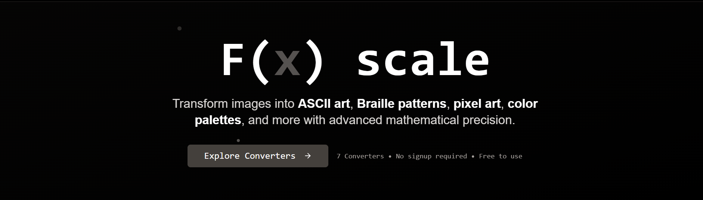

# F(x) scale - Advanced Image Transformation Platform

Transform your images into stunning visual art with our comprehensive suite of image converters. F(x) scale offers 7 specialized tools for creating unique artistic representations of your photos and images.

## 🚀 Features

- **7 Specialized Converters** - Each optimized for different artistic outputs
- **Real-time Processing** - Instant preview of transformations
- **Multiple Export Formats** - Download as images or text files
- **Responsive Design** - Works seamlessly on desktop and mobile
- **No Registration Required** - Start converting immediately
- **Privacy Focused** - All processing happens in your browser

## 🎨 Available Converters

### 1. ASCII Art Converter
Transform images into classic ASCII text art using characters of varying density.

**Use Cases:**
- Creating retro-style artwork for terminals and code comments
- Generating text-based logos for CLI applications
- Creating unique social media posts with character art
- Educational demonstrations of image processing concepts

**Features:**
- Adjustable character density and contrast
- Multiple character sets (standard, extended, custom)
- Downloadable as PNG image or copyable text
- Real-time preview with zoom controls

### 2. Braille Art Converter
Convert images to tactile Braille patterns, creating accessible art for visually impaired users.

**Use Cases:**
- Creating accessible artwork for visually impaired individuals
- Educational tools for teaching Braille patterns
- Unique artistic representations combining visual and tactile elements
- Assistive technology integration

**Features:**
- High-contrast Braille pattern generation
- Adjustable dot density and spacing
- Export as image for printing on tactile surfaces
- Text export for Braille display devices

### 3. Pixel Art Converter
Transform photos into retro-style pixel art with customizable resolution and color palettes.

**Use Cases:**
- Game development asset creation
- Retro-style social media avatars
- 8-bit style artwork for websites and apps
- Creating low-resolution art for embedded displays

**Features:**
- Adjustable pixel size and grid resolution
- Color quantization with palette reduction
- Dithering options for smooth gradients
- Export in multiple resolutions

### 4. Color Palette Extractor
Extract dominant colors from images to create beautiful color schemes.

**Use Cases:**
- Web design color scheme generation
- Interior design color matching
- Brand color palette development
- Digital art color reference creation

**Features:**
- Extract 5-20 dominant colors
- Multiple extraction algorithms
- Color harmony analysis
- Export palettes in various formats (HEX, RGB, HSL)

### 5. Text Portrait Generator
Create portraits using custom text, names, or quotes arranged to form facial features.

**Use Cases:**
- Personalized gifts with meaningful text
- Memorial portraits using favorite quotes
- Brand portraits using company values
- Artistic typography projects

**Features:**
- Custom text input with font selection
- Adjustable text density and size
- Multiple layout algorithms
- High-resolution output for printing

### 6. SVG Trace Converter (Beta)
Convert raster images to scalable vector graphics with edge detection.

**Use Cases:**
- Logo vectorization for infinite scalability
- Creating SVG assets for web development
- Preparing images for laser cutting or engraving
- Converting sketches to digital vector art

**Features:**
- Edge detection algorithms
- Adjustable trace sensitivity
- Path optimization for smaller file sizes
- Export as SVG or downloadable vector file

### 7. Fourier Transform Analyzer (Beta)
Analyze images in the frequency domain with advanced mathematical transformations.

**Use Cases:**
- Educational demonstrations of signal processing
- Image compression research and development
- Frequency domain filtering and analysis
- Scientific image processing applications

**Features:**
- 2D Fast Fourier Transform (FFT)
- Discrete Cosine Transform (DCT)
- Frequency domain filtering
- Phase and magnitude spectrum visualization

## 🛠️ Technology Stack

- **Frontend**: Next.js 14 with App Router
- **Styling**: Tailwind CSS with custom design system
- **UI Components**: shadcn/ui component library
- **Image Processing**: HTML5 Canvas API with custom algorithms
- **Animations**: CSS transforms and transitions

## 🚀 Getting Started

### Prerequisites
- Node.js 18+ 
- npm or yarn package manager

### Installation

1. **Clone the repository**
   \`\`\`bash
   git clone https://github.com/yourusername/fx-scale.git
   cd fx-scale
   \`\`\`

2. **Install dependencies**
   \`\`\`bash
   npm install
   # or
   yarn install
   \`\`\`

3. **Run the development server**
   \`\`\`bash
   npm run dev
   # or
   yarn dev
   \`\`\`

4. **Open your browser**
   Navigate to `http://localhost:3000` to see the application.

## 📱 Usage Examples

### Basic Image Conversion
1. Navigate to any converter page
2. Upload an image using the upload button or drag & drop
3. Adjust settings using the control panel
4. Preview the result in real-time
5. Download the converted image or copy the text output

### Batch Processing
1. Use the same converter for multiple images
2. Adjust settings once and apply to multiple files
3. Download all results individually

### Mobile Usage
- All converters are fully responsive
- Touch-friendly controls and gestures
- Optimized performance for mobile devices

## 🎯 Use Case Scenarios

### For Developers
- **ASCII Art**: Add visual flair to CLI tools and documentation
- **SVG Trace**: Convert logos and icons to scalable vectors
- **Pixel Art**: Create retro game assets and UI elements

### For Designers
- **Color Palette**: Extract colors for design systems
- **Pixel Art**: Create retro-style graphics and illustrations
- **Text Portrait**: Design unique typography-based artwork

### For Educators
- **Fourier Transform**: Demonstrate signal processing concepts
- **ASCII Art**: Teach image processing fundamentals
- **Braille Art**: Create accessible educational materials

### For Artists
- **Text Portrait**: Create meaningful personalized artwork
- **Braille Art**: Explore tactile and visual art combinations
- **All Converters**: Experiment with different artistic styles

## 🔧 Configuration

### Environment Variables
Create a `.env.local` file in the root directory:

\`\`\`env
# Optional: Analytics tracking
NEXT_PUBLIC_GA_ID=your-google-analytics-id

# Optional: Error reporting
NEXT_PUBLIC_SENTRY_DSN=your-sentry-dsn
\`\`\`

### Customization
- **Colors**: Modify `tailwind.config.js` for custom color schemes
- **Fonts**: Update font imports in `app/layout.tsx`
- **Algorithms**: Extend converter algorithms in individual component files

## 📊 Performance

- **Client-side Processing**: All image processing happens in the browser
- **No Server Uploads**: Images never leave your device
- **Optimized Algorithms**: Efficient processing for real-time feedback
- **Memory Management**: Automatic cleanup of large image data

## 🤝 Contributing

We welcome contributions! Please see our [Contributing Guidelines](CONTRIBUTING.md) for details.

### Development Workflow
1. Fork the repository
2. Create a feature branch (`git checkout -b feature/amazing-feature`)
3. Commit your changes (`git commit -m 'Add amazing feature'`)
4. Push to the branch (`git push origin feature/amazing-feature`)
5. Open a Pull Request

## 📄 License

This project is licensed under the MIT License - see the [LICENSE](LICENSE) file for details.

## 📞 Support

- **Documentation**: Visit our [docs page](/docs) for detailed guides
- **Issues**: Report bugs on our [GitHub Issues]

## 🗺️ Roadmap

- [ ] **Batch Processing**: Convert multiple images simultaneously
- [ ] **API Integration**: RESTful API for programmatic access
- [ ] **Cloud Storage**: Optional cloud save and share functionality
- [ ] **Advanced Filters**: More image processing algorithms
- [ ] **Mobile App**: Native iOS and Android applications
- [ ] **Collaboration**: Share and collaborate on image projects

---

**Made with ❤️ by the F(x) scale team**

Transform your images. Unleash your creativity.
